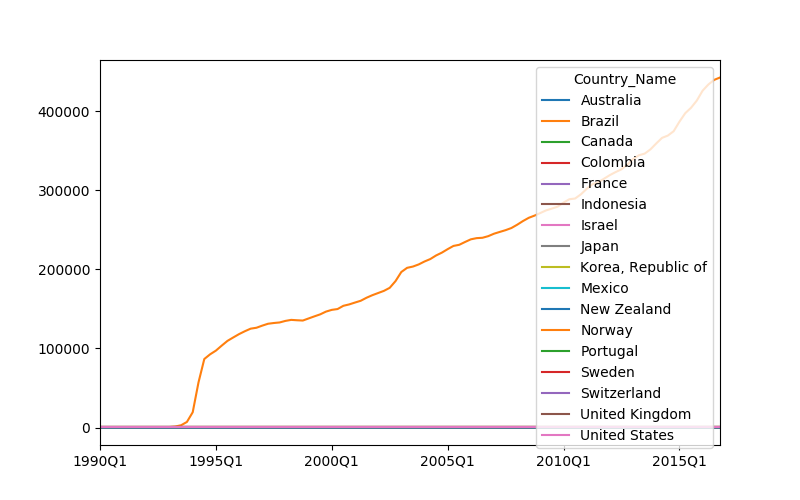
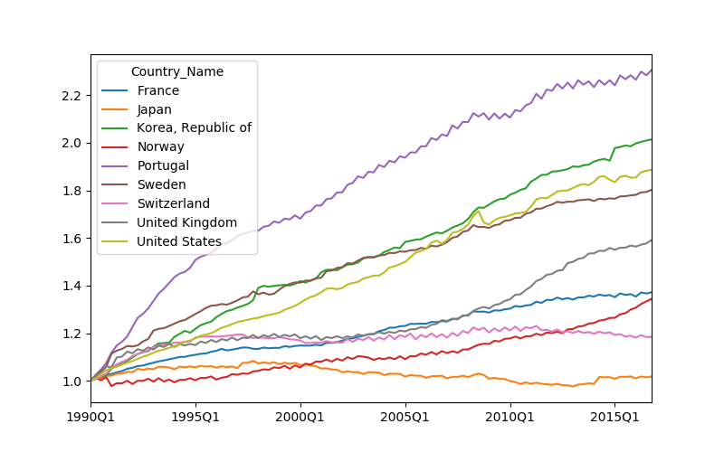
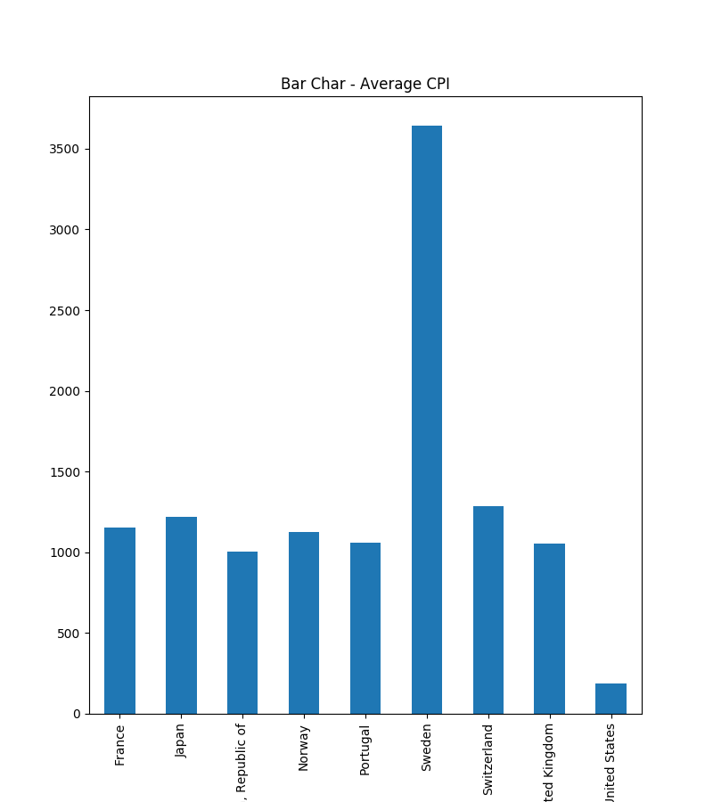
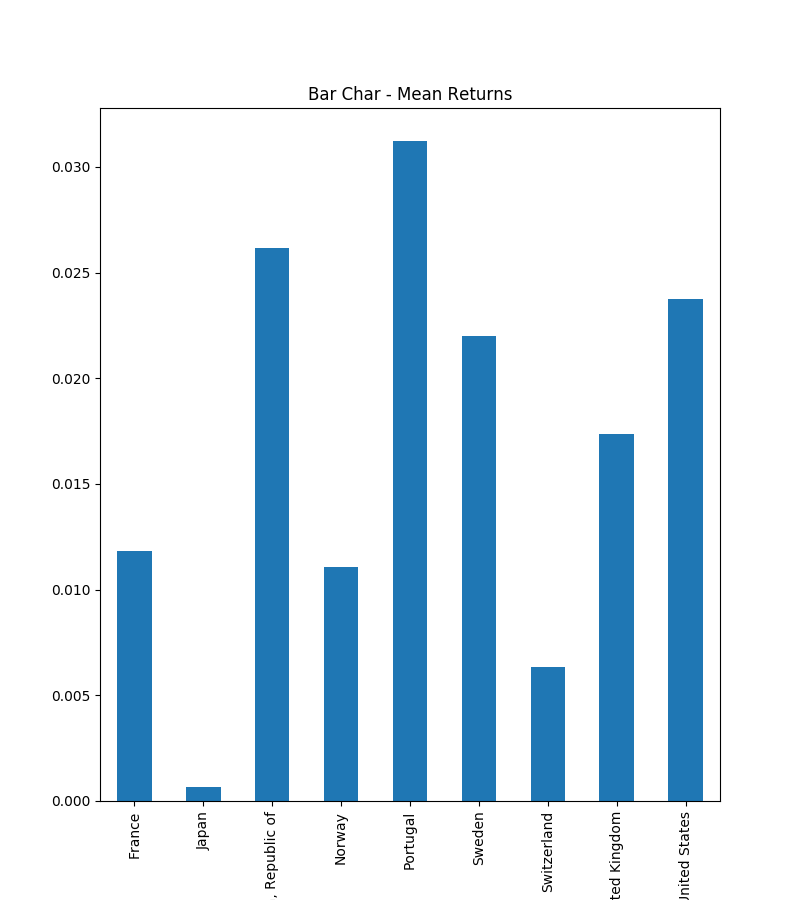
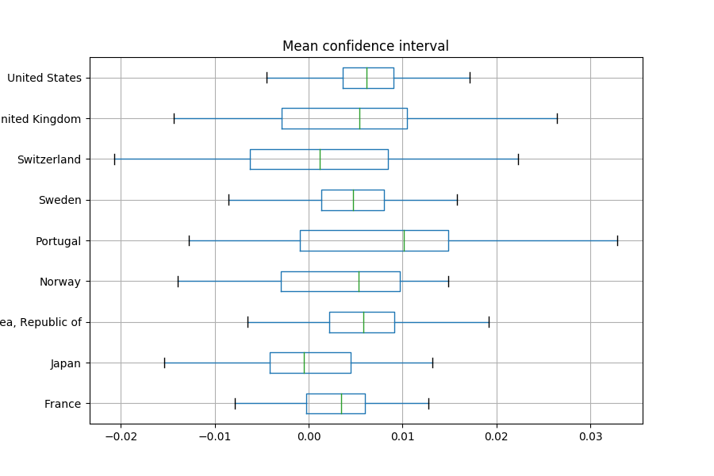

# About a dataset

## I took monthly CPI data from 1990 till the end of last year from IMF`s website. Data set contains most of the countries, but data is incomplete and pretty crapy

[Initial Dataset](./CPI_Data.csv)

## Cleaning Process

Data was pretty bad, lot of dublicates, extra rows and columns, obviously wrong entries. I had to rigorously clean it and reduce the list to only countries that have no missing data data. 

[Cleaned Dataset](./CleanedCPIdata.csv)

## Initial graph to visualize changes in CPI

Obviously we can tell that some data is pretty bad, so I dropped those countris that were screwing the graph. I dropped below contries:

['Brazil','Colombia','Israel','New Zealand', 'Mexico', 'Indonesia', 'Australia', 'Canada']

## Here is the final data and the graph

[Final Dataset](./FinalCPIdata.csv)

It looks much better and the changes in CPI levels looks reasonable and inline with expectations. There is many things you can do with that data, for example run regression and build prediction models. For simplicity I just graphed:

### CPI levels as a bar chart

### Mean returns as a bar chart

### Box plot, showing means and confidence intervals to see, which on those cantries had highest grows in CPI index over past 26 years. Portugal did!

